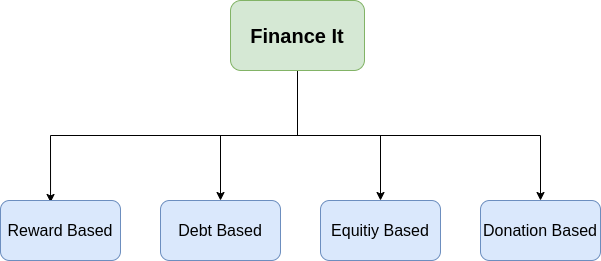
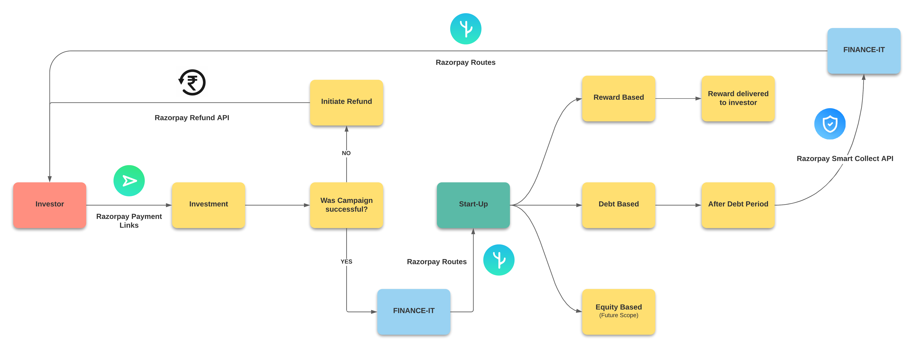
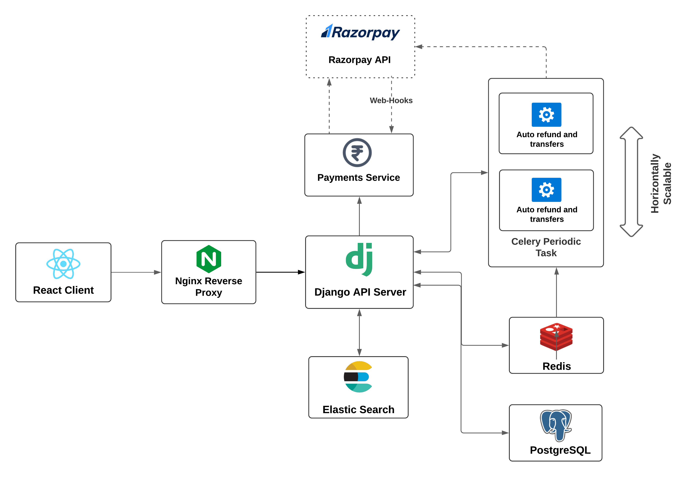

# Finance-It

## Crowdfunding Platform for Start-ups and SMEs

India has the **3rd largest startup ecosystem in the world**; expected to witness YoY growth of a consistent annual growth of 12-15%.

India has about 50,000 startups in India in 2018; around 8,900 – 9,300 of these are technology led startups 1300 new tech startups were born in 2019 alone implying **there are 2-3 tech startups born every day.**

## Present Scenario

Traditionally, Start-ups are funded through private equity, angel investor or loan arrangements with a financial institution. Any offering of public equity takes place only after the product or business becomes commercially viable. However, we propose a way where the solicitation is done at an earlier stage.

## What We Propose

A crowdfunding platform called Finance It, where any retail investor can invest in a startup listed on the platform.
The Investment can be done in one of the following ways

  

## Logic Flow

  

## System Architecture

  

